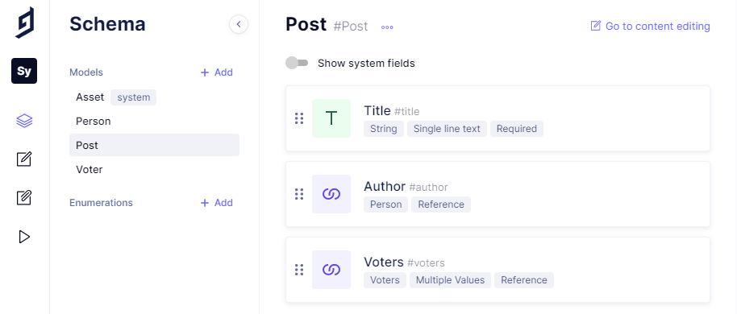

# BACKEND
1. [WHY do we use Graphcms?](#why-do-we-use-graphcms)
2. [Setup](#setup)
3. [Run?](#run)

<hr/>

## WHY do we use Graphcms?

#### :fast_forward: Easy to setup Database
Just visit "https://graphcms.com" and through a few steps we now have a database and graphql native.:ok_hand:

#### :baby: Easy to use
Graphcms provides a lot of tutorials at "https://graphcms.com/docs" and many examples across many platforms and libraries "https://graphcms.com/docs/develop/code-examples".

#### :people_holding_hands: Teamwork is more efficient 
Because the server is always online, all team members can easily update the status and synchronize the data in the database with each other.

#### :muscle: Create Schema easily with Powerful Editors
Graphcms supports a variety of GUIs and utilities to quickly and explicitly create a schema. In particular, we just drag, drop, and fill options.

####	:handshake: Support creating Mutation and Query
When we create a Model in Schema. Then Graphcms will also automatically create a series of mutation APIs that support the Create, Read, Update and Delete of the Model. This saves us a lot of time and code management.
In addition, Graphcms also provides us with a utility interface "API Playground". This will help us create complex GraphQL queries.

#### :lock: Security
Setting up access security, Team settings, roles and permissions on Graphcms is also extremely simple.

<hr/>

## Setup 

1. Sign up at [GraphCMS](https://graphcms.com/) and create a project there.

2. Define a schema with three types `Post`, `Person` and `Voter`.

3. Get your `GRAPH_CMS_ENDPOINT` and optionally create a `GRAPH_CMS_API_TOKEN` in Settings. And save in `.env`.

4. Store also a JWT secret in `.env`.

## Screenshots

Type `Post`:




Type `Person`:


Type `Voter`:


`GRAPH_CMS_ENDPOINT`:


`GRAPH_CMS_API_TOKEN`:


<hr/>

## Run

Before running test you need to create a file .env in backend root with the JWT secret, e.g. JWT_SECRET=jsonwebtoken

``` bash
# setup
yarn install

# lint
yarn lint

# run test
yarn test

# start server at localhost:4000
yarn start

```

<hr/>

## Contribution

Wish to contribute?
We communicate over Moodle:

https://moodle.htw-berlin.de/mod/bigbluebuttonbn/view.php?id=774135

Similarly, we have a Telegram group, if you wish to participate, please contact one of us:

Andrej Loparev:
Andrej.Loparev@Student.HTW-Berlin.de

Truong An Nguyen:
Truong.Nguyen@Student.HTW-Berlin.de

Ilona Eisenbraun:
Ilona.Eisenbraun@Student.HTW-Berlin.de